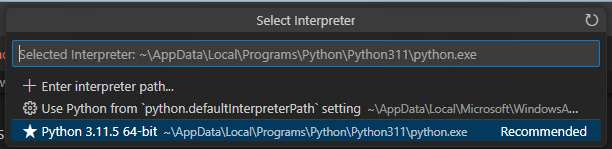

## Continuation of Malware C2 Development
Git repo for BSides Workshop; an interactive course to design and create a simple C2 toolset. We will be conintinuing to refine and imporve our C2 to learn the ins and outs of C# and .net programing.

**Learning Objectives**
- Intro to programing concepts
- Use of Python Flask
- Using C# Libraries
- Building .net projects
- Debugging Code in Visual Studio Code
- Reflective loading
- Using powershell "runspace" environment in .net
- Incorporating 3rd partry projects

**Student Requirements**
- A IDE that you feel comfortable with; Visual Studio Code will be used for the demo
    - https://code.visualstudio.com/Download#
    - If using VS code the C# extension is very helpful https://code.visualstudio.com/docs/languages/csharp#_installing-c35-support

- .net SDK for building Agent. 6.0 and 4.7.2
    - https://dotnet.microsoft.com/en-us/download/visual-studio-sdks

- We will be using Python3 for the server 
    - VS Code link https://marketplace.visualstudio.com/items?itemName=ms-python.python
    - Stand Alone Install https://www.python.org/downloads/

- Computer or VM running Windows (Demo/testing will be aginst 11)

- Git for Windows; techically not needed but makes life easier
    - 64-bit Git for Windows Setup https://git-scm.com/download/win


**Getting Started**
- git clone this repo localy
- ```pip install -r .\requirments.txt``` 
    - or just ```pip install flask``` as that's the only requirment for now
- open folder in VS code
    - If VS code asks to fiddle with the project first time opening, go ahead and let it, it's setting up some build tasks for you
- right click server\server.py and "run python file in terminal"
    - If this is your first python project you might have to tell VS Code where you installed python.
    - 
- build implant with ctrl+shift+b
    - if VS code didn't set you up you can cd into C2 folder and run "dotnet build"
- start implant ```.\C2\bin\Debug\net6.0\SimpleC2.exe```
    - you'll get your call back in your python window and can test out the revserse shell functionality


**Goals for Project**
- [x] HTTP beaconing server
- [x] .net based reverse shell
- [x] Reverse shell functionality 
- [ ] Extend functionality with custom commands
- [ ] Ability to load .net assemblies
- [ ] Create a payloads to extend functionaliy
    - [ ] Keylogger
    - [ ] Disable logging
- [ ] Ability to run powershell scripts